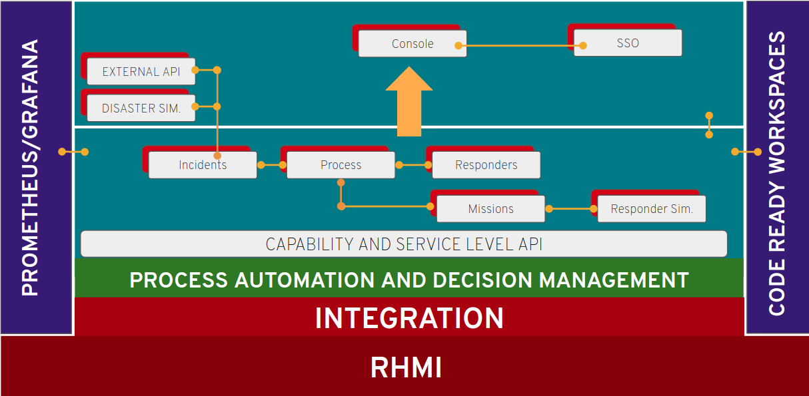
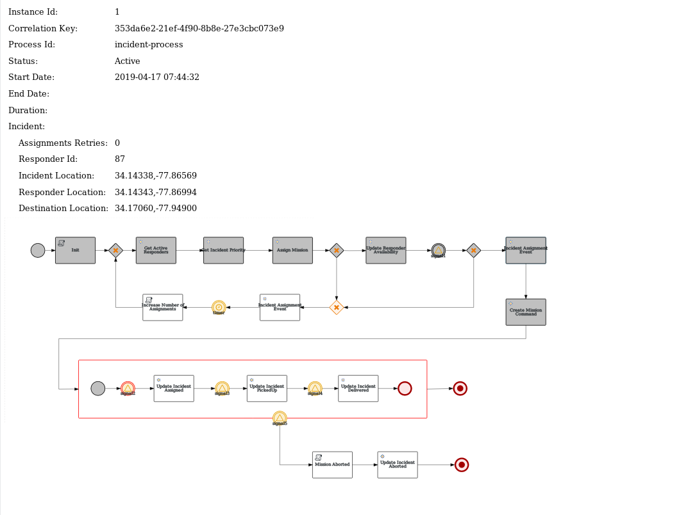

# Introduction

What is this about?
In August 2017, Hurricane Harvey caused massive flooding in Southeast Texas, USA. The storm left a number of residents stranded and in need of rescue. Emergency first responders were overwhelmed with the high volume of rescue calls. A loose-knit group of volunteer boaters assisted in the rescue effort. These volunteers explored neighborhoods seeking out residents who needed assistance. In addition, with the support of social media, a group of volunteers served as dispatchers to relay rescue requests to the volunteer boaters. This group of volunteers became known as the Cajun Navy. The Cajun Navy has been operating in various forms since Hurricane Katrina in 2005.

Our team was tasked to ensure there is a solution that will help to organize this effort, so responders are dispatched to the right locations and to the right victims, that match with, location, medical needs etc. All to ensure organization and optimization of this effort.

Our team started working on this solution and came up with an architecture flow as follows.

- Incidents come in via a REST API. [Incident API Specification](../instructions/IncidentServiceAPISpec.md)
- Incidents are then sent to a Process Service that takes decisions on what which responder to dispatch to which incident.
- Once the process service decides it send a Command to the Mission Service; and the mission service fetches data from Mapbox API and creates a new mission with all details, routes. and sends a new event called MissionCreated.
- Responders simulator listens to this and gets all details and starts to simulate the movements of the responder. The responder simulator sends the update events timely and once completed send an event saying the responders has not further action.
- Mission service then terminates that mission and send a new Command called Mission Completed, to this the process service takes to task and makes all necessary completions to the process.

Following is how the Overall flow looks like, a screen shot from our Process Viewer service.

Some basic architectural rules
- All backend uses Kafka/AMQStreams to talk to each other.
- All front-end, i.e. for outside of the system makes call directly via REST.
- One exception to the above is, the emergency console that pulls on REST for the first time it loads to get the state of the system, and every new event is then consumed from Kafka. (While there could be better approaches to do this, at this time this is how it looks, feel free to make a PR/Issue in case of better ideas.)
- All services implement an end-point called /metrics which is then picked up via Prometheus and shown on the the Grafana dashboard.

You are now the new upcoming stars of our team, following is your secret mission to improve our solution.
* [Instructions for participants](instructions/README.md)
