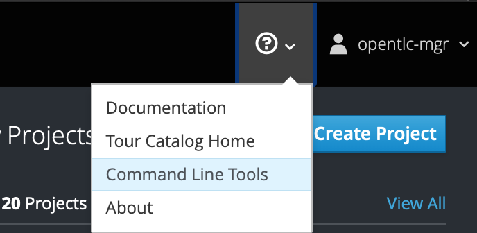
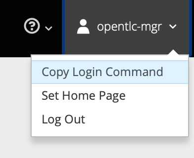

Getting Started
==
Following is a checklist, make sure you have everything verified and ready to start developing. Good luck!


Verify your cluster and environment into Openshift
====
`Master URL` - is the address of the Openshift master node, and `/console` is the Openshift Console where you can see all your projects and file. 

`Emergency Console` - is the Emergency response solutions main dashboard.

`Disaster Simulator` - is a console for simulating incdient events, or creating the responders etc.

Enough about the consoles. you should by now know which team you belong to, and also the Master URL should have been provided to you with a USERNAME and PASSWORD. Lets try to login and ensure that everything is working.

Login via the webconsole by hitting the URL and credentials provided to you. 
Make sure you have successfully logged in. 
If you do not have the openshift CLI installed on your machine. You can download it from the webconsole itself. Click on the following link as shown in the picture to download the `oc` command line utility for your machine.



Once you have setup the oc client lib, make sure its in your PATH.

You can then login to Openshift with the following commands
```
$ oc login -u $USERNAME $URL
```
Or if you prefer you can also use the token by grabbing it from the webconsole. to do that copy the login command from the right hand top corner of the webconsole as shown in the picture.



Once logged in from the command line. 
It would be suggestable to create a temporary project, while you try out your new service. To do that create a new project for your development playground as follows.

```
$ oc new-project my_new_incident_service
```
Also lets take a quick look at the projects, you can do this via the webconsole or run the following command

```
oc projects
```
In the listed projects you should see your newly created project and also the following

`emergency-response-demo` - this is our main project where are services reside

`tools-erd` - other tools like Postgresql, pipelines, nexus reside in this project

 `middleware-monitroing` - prometheus/grafana are in this project

This is a quick verification and checking of the system that everything is in order for you to get started. 

Getting Started with GIT
====
You should start by forking this repo
Navigate to [this repo](https://github.com/Emergency-Response-Demo/workshop-hackathon)


The following instructions assume you have a git command line installed and working. 

Assuming you are in your forked repo dir. execute the following command to create an upstream remote so we can keep your fork upto date.
```
git remote add upstream https://github.com/Emergency-Response-Demo/workshop-hackathon.git
```

Now if you run the following command you will see the upstream repo also listed. 
```
$ git remote -v 

origin	https://github.com/sshaaf/workshop-hackathon.git (fetch)
origin	https://github.com/sshaaf/workshop-hackathon.git (push)
upstream	https://github.com/Emergency-Response-Demo/workshop-hackathon.git (fetch)
upstream	https://github.com/Emergency-Response-Demo/workshop-hackathon.git (push)
```

git pull will pull changes from your current branch. 

git pull upstream will bring all changes from the upstream repo.

In this repo you will see two folders. 

*1. docs*
*2. solutions*

`docs` holds all our documentation. 
`solutions` holds some basic solutions with Quarkus, Fuse, Spring, Vert.x, they can be treated as a getting started project if you would like to get some inspiration. 

At anytime you think that you would like to make this repo better, create an issue and perhaps a subsequent PR for it. (we dont expect that in todays hackathon, but its worth mentioning)


Running Kafka locally
==== 

You can download Kafka from here [Kafka Community](https://www.apache.org/dyn/closer.cgi?path=/kafka/2.3.0/kafka_2.12-2.3.0.tgz)

Some basic command to get started and also easier to test with
   ```
# Make sure Kafka is running e.g 
bin/zookeeper-server-start.sh config/zookeeper.properties
bin/kafka-server-start.sh config/server.properties

# Creating the topic
bin/kafka-topics.sh --create --zookeeper localhost:2181 --replication-factor 1 --partitions 1 --topic orders

# Listening to the topic on the console
bin/kafka-console-consumer.sh --topic topic-incident-event --from-begining

# Sending message into a topic
bin/kafka-console-producer.sh --broker-list localhost:9092 --topic topic-incident-command
   ```

