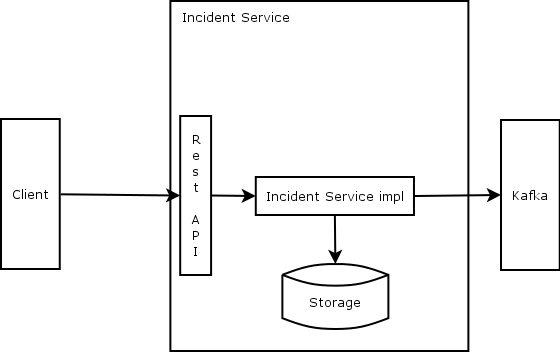

# Incident API spec

Any implementation of the Incident Service must comply with the following guidelines in order to be fully operationable.

* The service exposes a rest API as specified in the [OpenAPI specification](https://raw.githubusercontent.com/Emergency-Response-Demo/incident-service/master/openapi.json). Any implementation must comply with this interface.
* All incidents received must be persisted and returned on later calls.
* There are no requirements on specific storage solutions, but keep in mind that we work with microservices, so solutions which enable moving workloads easily are preferred.
* The incident service must notify other services on any incidents received. This is done by posting to a Kafka Topic.

[//]: # "TOOD describe the Kafka topic interface."