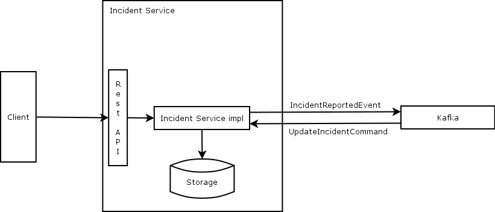

# Incident API spec
## Introduction
This document contains a description of the Incident Service and all of its functions. It starts with a high level description and after that contains more details on each topic.

The emergency response solution is comprised by several microservices as described in [the Emergency Response Demo Architecture guide](https://www.erdemo.io/architecture/). The whole solution is running on OpenShift, so when this document when there are referenced to the cluster, containers, etc, it's assumed that all of this points to an OpenShift cluster.



As you can see in above diagram, the Incident Service consists of different parts. Clients connect to a REST API, which enable other services to access information about incidents. An incident consists of one or more persons in need of help as well as a location. For all properties of an incident, please refer to he [OpenAPI specification for the Incident Service](https://raw.githubusercontent.com/Emergency-Response-Demo/incident-service/master/openapi.json), which also contains usefull information about, which services to implement, as well as which message formats to exchange with Kafka. Each time an incident is created, an _IncidentReportedEvent_ must be sent. Other services will send a _UpdateIncidentCommand_ to notify the Incident Service on any changes to an incident.

Finally the Incident Service implements a health check API to let the cluster know if the service is up and running.

Please refer to the following sections for more details on each topic.

## REST API implementation
The service exposes a rest API as specified in the [OpenAPI specification](https://raw.githubusercontent.com/Emergency-Response-Demo/incident-service/master/openapi.json). The service exposes five paths and any implementation must comply with this interface.

## Persistence
The incident service will need some kind of persistence. There are no requirements on specific storage solutions, but keep in mind that the Incident service is a microservice, so any implementation needs to be able to be restarted - possibly in another node in the cluster.
* All incidents received must be persisted and returned on later calls.
* There are no requirements on specific storage solutions, but keep in mind that we work with microservices, so solutions which enable moving workloads easily are preferred.

## Kafka integration
There are two relevant topics on the Kafka queue, which the incident service must integrate to.

Topic name | Send/Receive | Description | Format
--- | --- | --- | ---
topic-incident-event |  Send | Notify other microservices that a new incident has been created. | _IncidentReportedEvent_
topic-incident-command | Receive | Get notifications from other microservices when an incident has changed | _UpdateIncidentCommand_

In order to connect to the Kafka server, use the following url _kafka-cluster-kafka-bootstrap.emergency-response-demo.svc.cluster.local:9092_

Both the _IncidentReportedEvent_ and _UpdateIncidentCommand_ formats are included as data types in the [OpenAPI specification for the Incident Service](https://raw.githubusercontent.com/Emergency-Response-Demo/incident-service/master/openapi.json).

Example of _IncidentReportedEvent_:
```
{
  "id":"fe6bcee7-5447-4b0d-8c7f-a9ca4f10eb14",
  "messageType":"IncidentReportedEvent",
  "invokingService":"IncidentService",
  "timestamp":1573513503569,
  "body":{
    "id":"fe6bcee7-5447-4b0d-8c7f-a9ca4f10eb14",
    "lat":55.693615,
    "lon":12.567255,
    "numberOfPeople":12,
    "medicalNeeded":true,
    "timestamp":1573464689
  }
}
```

Example of _UpdateIncidentCommand_:
```
{
  "id":"ea9f2f52-2b56-448b-b388-b6ff16368050",
  "messageType":"UpdateIncidentCommand",
  "invokingService":"IncidentProcessService",
  "timestamp":1573815193958,
  "body":{
    "incident":{
      "id":"ea9f2f52-2b56-448b-b388-b6ff16368050",
      "status":"RESCUED"
    }
  }
}
```

## Health service
A full implementation must provide an endpoint _/actuator/health_, which can tell wether the service is up and running. Only requirement is, that it returns http code 200 if the service is up.