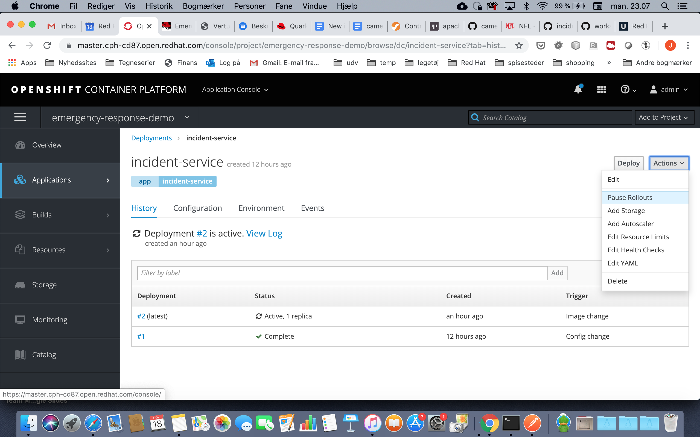
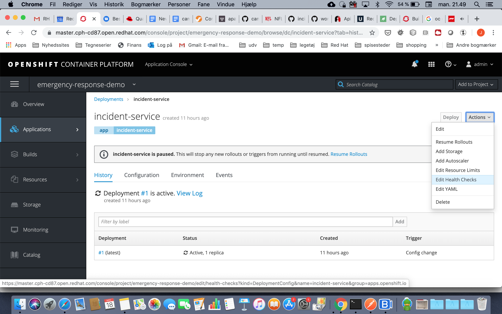
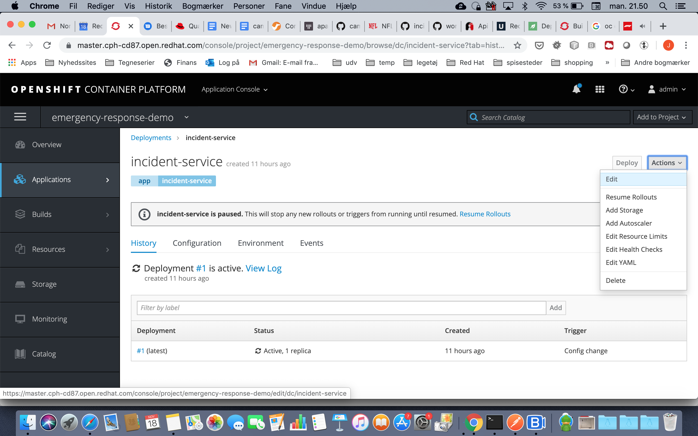
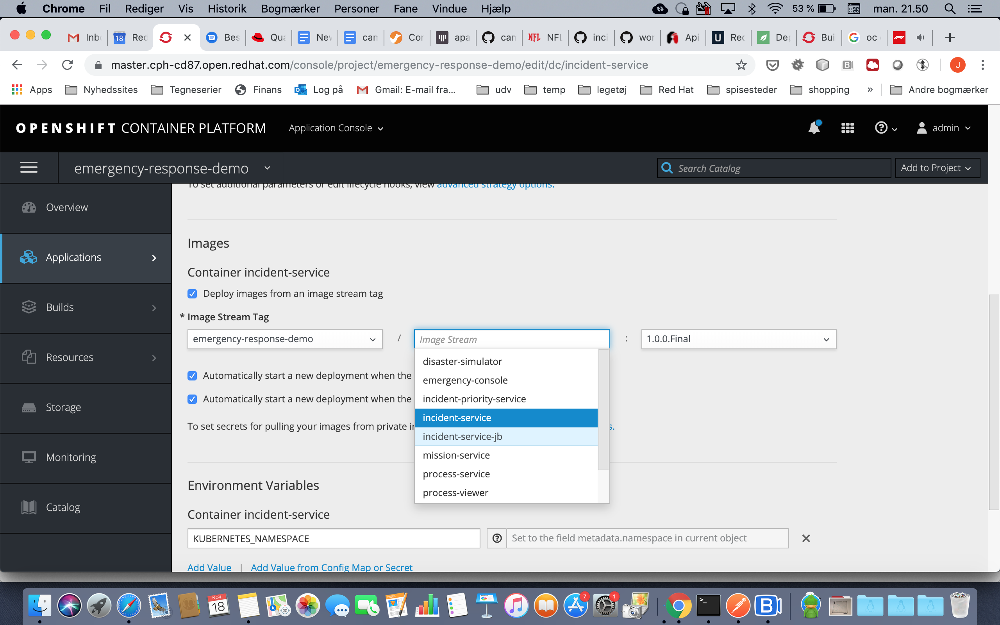
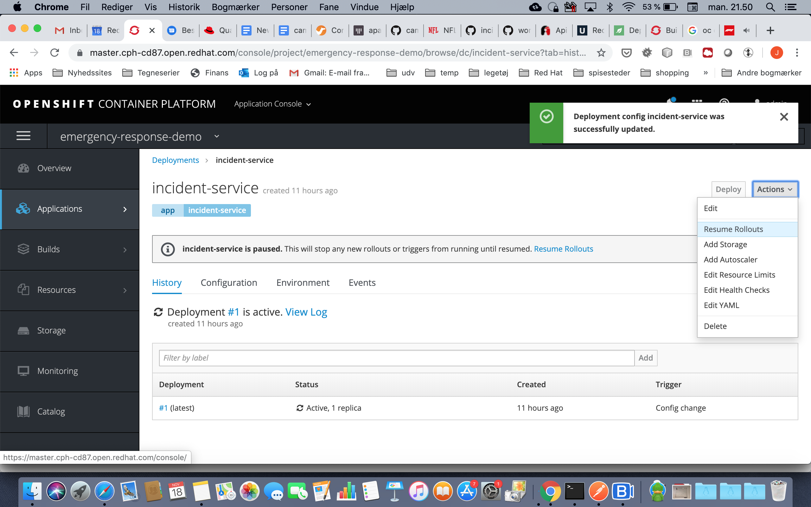
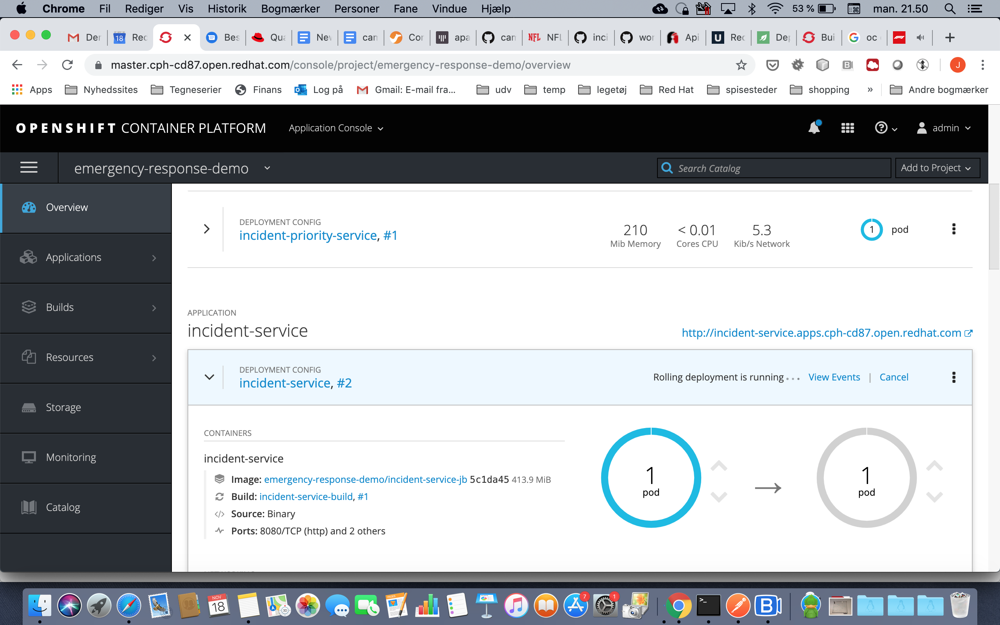

# Incident Service Deploy Guide
## Building the Incident Service Image
There are many ways to deploy an application into OpenShift. The most common methods are:
* s2i pointing to a git repository
* using the fabric8 module
* pipelines

Feel free to investigate the different options. The following text will describe how to use s2i combined with a local filesystem. This option is simple and allows you to easily discover what is done under the hood of OpenShift.

First change to the project containing the emergency response project.
```
oc project emergency-response-demo
```


Then create an imagestream, using the following command
```
echo 'apiVersion: v1
kind: ImageStream
metadata:
  labels:
    application: incident-service-<insert your alias>
  name: incident-service-<insert your alias>'|oc create -f -
```
An image stream is an abstraction over one or more container images, where you can provide informations about registry locations, labels, etc.

Next you need a build config, which will tell OpenShift which build strategy, labels and so on you want for your application.
```
echo 'kind: "BuildConfig"
apiVersion: "v1"
metadata:
  name: "incident-service-build" 
spec:
  runPolicy: "Serial" 
  strategy: 
    sourceStrategy:
      from:
        kind: "ImageStreamTag"
        name: "java:8"
        namespace: openshift
  output: 
    to:
      kind: "ImageStreamTag"
      name: "incident-service-<insert your alias>:latest"'| oc create -f -
```
In this case, we will use a Java8 s2i image, and the output of the build will be output to your newly created image stream.

Now you are ready to build your application, using s2i. From _$WORKING_DIR_, simply run the command
```
oc start-build incident-service-build --from-dir .
```
This will trigger your build. You can investigate how the build is doing by running
```
$ oc get build
NAME                       TYPE      FROM             STATUS     STARTED        DURATION
incident-service-build-1   Source    Binary@5206ef1   Complete   11 hours ago   4m55s
```
which will list the current builds and their status. To investigate the log wile the build is running, use
```
oc logs build/incident-service-build-1 -f
```
Replace the name of the build with the one you got running _oc get build_. Once the build has finished successfully, you are ready to exchange the existing implementation of the Incident Service with your implementation.

If you want to know more about build strategies, please refer to the section [Builds and Image Streams](https://docs.openshift.com/container-platform/3.11/architecture/core_concepts/builds_and_image_streams.html) in the documentation.

## Replacing the Incident Service Image with your implementation
If you have implemented the health check service endpoints, you can skip directly to [Replacing the Incident Service](#replacing-the-incident-service). Otherwise read on
### Removing health checks
Login to the OpenShift console and click on the project named _emergency-response-demo_. Next from the menu select Applications -> Deployments. Then click on incident-service. OpenShift will make a new deployment of the incident service each time any change is made to the configuration. You really want to avoid that at the moment, since you need to make several changes. 

Therefore as a first action you select _Pause Rollouts_ in the _Actions_ menu.


With that in place, let's make the necessary changes. First you can disable the health checks. Be aware that this will have the effect that the container is listed as ready as soon as your application is spun up. It will only be listed as failing if your application is crashing with a system exit.

Click _Edit Health Checks_ in the _Actions_ menu.


In the health checks screen click _Remove Readiness Probe_. While you're at it, also click _Remove Health Probe_. After all ignorance is bliss:-) Click 'Save' to confirm the changes to the configuration.


### Replacing the Incident Service
Now it's time to replace the incident service. Click _Edit_ in the _Actions_ menu.


In the screen appearing, scroll to the _Images_ section of the screen and select your image instead of the default implementation. Remember to also select a valid version of your image (probably _latest_ if you didn't change the image build config).

Click _Save_ to confirm your changes.

If you paused the rollouts earlier, now is the time to resume to see the effect of your hard work. To do so click _Resume Rollouts_ in the _Actions_ menu.
.

### Monitoring the Incident Service
Now you can monitor the rollout of the Incident Service. Click on the _Overview_ menu item and see the beauty of OpenShift combined with your code unfold.
.

 Under incident-service you will see your application being deployed. Once the grey ring becomes solid blue, your application is ready for testing; though you might want to inspect the log of the pod if you didn't implement health checks.